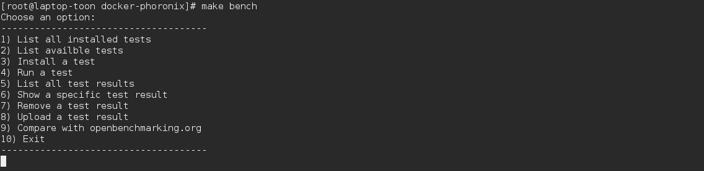

# docker-phoronix
Benchmarking docker container with phoronix test suite

This project deploys a docker container with Phoronix Test Suite installed, as well as a couple of tests that are predefined in the Dockerfile.  

The purpose of this container will solely be to benchmark your docker-machine.  
For ease of use, a couple of 'make commands' are supplied within this repo.` 

## Installation


After cloning the repository, just execute these commands:

#### Building the Docker image  

```
$ make bench_deploy
```

#### Usage

```
$ make bench
```

This will run the container together with the supplied script. The script returns a menu from which you can choose an option.



After you exit from this menu, the docker-bench container will be automatically removed.
